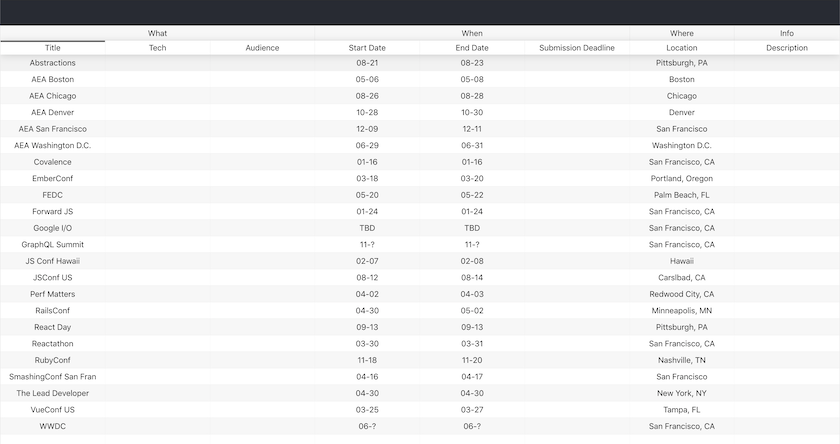

### Screenshot

### Background

I regularly miss conference sign-ups and wanted to find a place to aggregate all relevant conferences.

### Summary

View an aggregated list of tech conferences with the ability to search, sort, filter and add new entries.

### How it works

This is a lightweight static react app that is powered by a single json file for its dataset.

### Take Aways

* Static apps can be quite powerful and do not require much work to get setup.
* Using a static file datastore allows for easy edits, even through source control (eg. github pull request).

### Next Steps

* Improve search/sort/filter UX