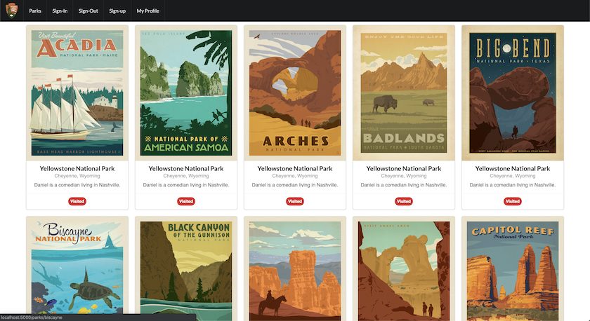

### Screenshot

### Background

I like to explore the outdoors and have a goal of visiting all the National Parks, so I figured I'd make an app.

### Summary

App to show National Park information and track which ones you've visited.

### How it works

This is a simple static react app that renders rich metadata for national parks.
It uses a public API to fetch national park data.

### Take Aways

Using external APIs from a client can be simple, but also can introduce latency in your application as the client waits for a response.

### Next Steps

* Add a DB. There is no database yet, so users are not authenticated and cannot save visits to their profile. 