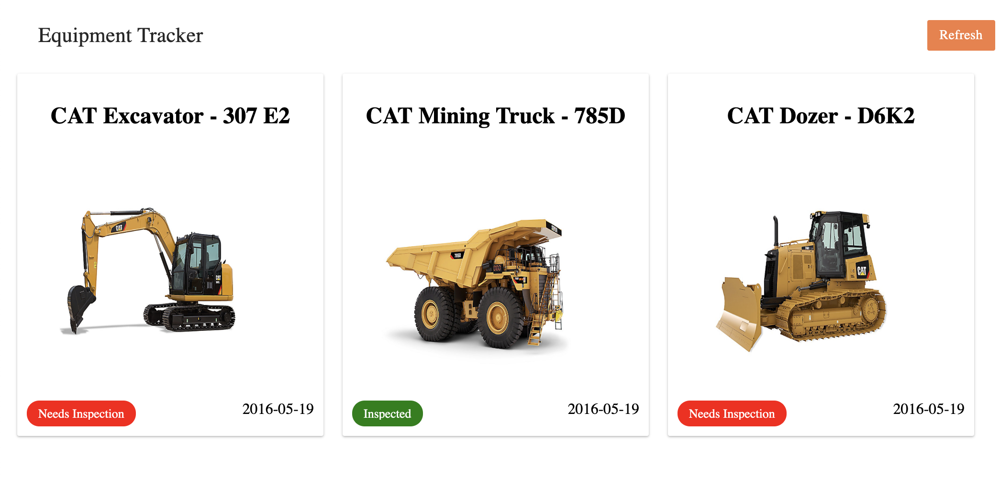

### Screenshot

### Background
As more and more apps get built, it begs to question:
* Can web apps render other web apps?
* While we all know this is possible with iframes, is it also possible to render rich js applications natively inside other rich js applications?
* Can this all be done client-side or do you need magic manipulation on a server.

It turns out the answer is yes, no server necessary.

### Summary

This app is a proof-of-concept that shows you can indeed render js clients inside other js clients. It's just javascript after all. `EquipmentTracker` was built as a static js client to be used in this proof of concept.

### How it works

1. Build a static web app
2. Publish the static web app to a CDN
3. The static app should include a mount function that can be called externally to load up the app. (Basically, this will assign any props to the correct DOM node and execute the js file.)
4. Build a shell application that loads up the static client remotely (`ie. as a <script> tag or via fetch()`)
5. Upon load, the shell application executes the client.mount() function which initiates the client and mounts it to the DOM.
6. Success!

### Take-aways

* Building JS clients can be easy. There are plenty of tools that make it simple.
* Embedding apps in apps, allows for endless layers of composition.
*

### Next Steps

* Include the shell application in the example & docs